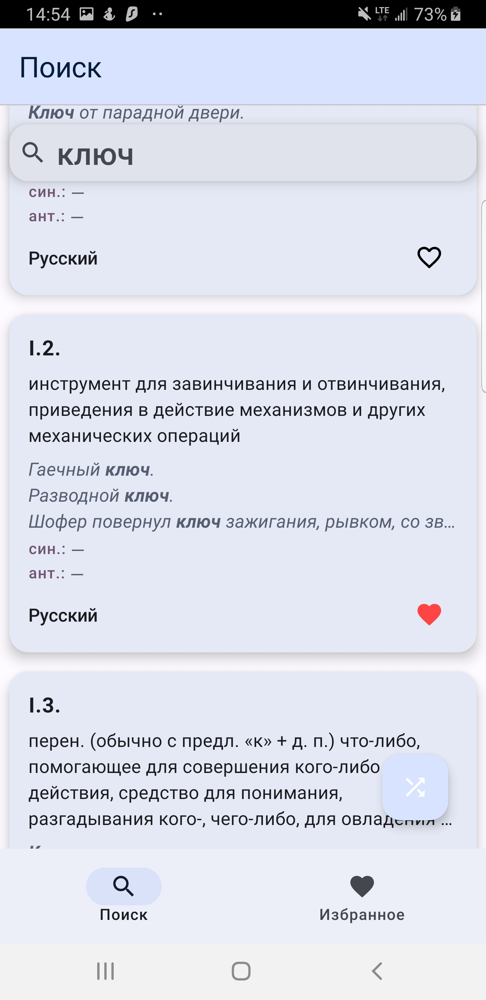

# Dictionary

## Описание

Многоязычный словарь. Серверная часть приложения содержит базу данных, использующую данные из
распарсенной базы статей викисловаря.

## Стек технологий

* Jetpack Compose
* RxJava 2 (В целях обучения)
* Retrofit
* kotlinx.serialization.json
* Dagger Hilt
* Navigation Component
* Data Store
* Paging

## Скриншоты

<figure>

<figcaption>Карточки определений</figcaption>
</figure>
<figure>

<figcaption>Подробнее</figcaption>
</figure>
<figure>

<figcaption>Избранное</figcaption>
</figure>
<figure>

<figcaption>Поиск</figcaption>
</figure>
